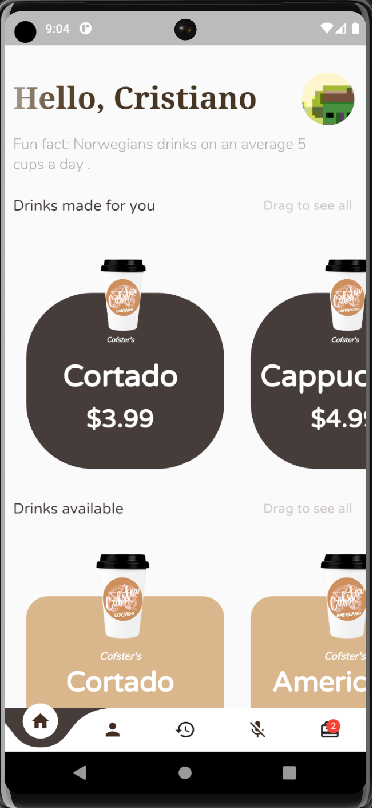
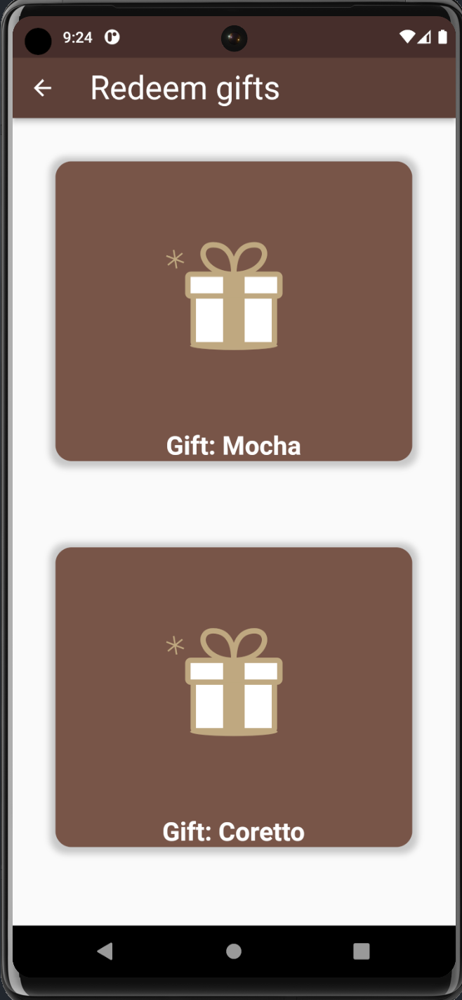

# Cofster (Smart Coffee Machine System)

Cofster is a sophisticated and innovative solution that combines cutting-edge technologies to revolutionize the coffee brewing experience. With advanced features such as personalized drink recommendations, voice recognition, and cloud integration, this system offers a seamless and convenient way to prepare your favorite coffee beverages.

## Getting Started

Follow these steps to set up the Smart Coffee Machine System:

1. Clone the repository: `git clone https://github.com/your-username/smart-coffee-machine.git`
2. Run frontend with the setup specified below.
3. Run backend with the setup specified below.
4. Configure the necessary cloud services and APIs by following the instructions provided in the documentation.
5. Connect the hardware components as specified in the hardware setup guide.

## Frontend Setup

To run the frontend, navigate to the root directory and then to the `mobile_app_frontend` directory, and execute the following command:

```sh
flutter run
```

## Backend Setup

1. Install docker
2. Navigate to the microservices directory.
3. Build the Docker images for each microservice except the coffee_creation one (if you want to do CUDA inferencing on the YOLO models, don't build the image for the cup_detection microservice) using the following command:

```sh
docker build -t "image-name" .
```
4. After building the Docker images, return to the root directory.
5. Start all microservices using docker compose, with the following command:
6. 
```sh
docker compose up
```
7. For the coffee_creation microservice, you should have an edge device, preferably a Raspberry Pi (should work for any version of RPI).

To run the server on boot, follow these steps:

- **Navigate to the microservices/coffee_creation directory on your Raspberry PI. 
- **Execute the following shell script:

```sh
bash boostrap_loader_service.sh
```
Ensure you have a service created to run the process on boot. To create the service:

- **Navigate to the system service directory:

```sh
cd /etc/systemd/system/
```

- **Create the coffee making service unit file. An example file named bootstrap-coffee-making-service.service is provided in the microservices/coffee_creation directory.

8. If you want to close the backend, power off the Raspberry Pi, as well as run the following command on your localhost:

```sh
docker compose down
```

## Optional: CUDA Inference Setup

If you are doing inference, you can also use your own GPU for the YOLO models. You just need to do the following things:

1. Navigate to the microservices/cup_detection directory.
2. Install the necessary Python dependencies using:

```sh
pip install -r requirements.txt
```

3. Run the cup detection microservice:

```sh
python app.py
```

## App Features

- **Mobile App Control**: The system can be controlled through a user-friendly mobile app, allowing you to easily select and customize your coffee preferences.
- **Personalized Drink Recommendations**: By leveraging machine learning techniques, the system analyzes user responses to provide personalized drink recommendations based on individual tastes and preferences.
- **Voice Recognition**: Interacting with the system is effortless using voice commands. Simply speak your desired drink options, and the system will respond accordingly.
- **Location Services**: Integrated with Google Maps, the system can identify your location and display nearby coffee shops, making it easy to find a great cup of coffee wherever you are.
- **Hardware Control**: Using Raspberry Pi, relays, and pumps, the system accurately controls the coffee machine to ensure precise beverage preparation.
- **Cloud Services Integration**: The system leverages cloud services, including AWS microservices, for seamless data storage, retrieval, and communication between the backend and frontend components.
- **Clean Architecture Design**: The system follows a clean architecture, with the backend hosted on AWS and the frontend developed using Flutter. This design approach ensures modularity, scalability, and maintainability.

## Screenshots

Include screenshots here to showcase the user interface of the mobile application. You can add images to the `screenshots` folder and reference them like this:

<div style="text-align: center;">
  <div style="display: inline-block; padding-right: 100px; text-align: center;">
    
    
  </div>

  <div style="display: inline-block; text-align: center;">
    
    
  </div>

  <div style="display: inline-block; padding-left: 60px; text-align: center;">
    
     
  </div>

  <div style="display: inline-block; text-align: center;">
    
    
  </div>

  <div style="display: inline-block; text-align: center;">
    
    
  </div>
  
  <div style="display: inline-block; text-align: center;">
    
    
  </div>

  <div style="display: inline-block; text-align: center;">
    
    
  </div>

  <div style="display: inline-block; text-align: center;">
    
    
  </div>
</div>

## Contributing

Contributions are welcome! If you encounter any issues or have ideas for improvements, please open an issue or submit a pull request. I appreciate your feedback and contributions to make the Cofster even better.

## License

This project is licensed under the MIT License. See the [LICENSE](LICENSE) file for more information.

## Acknowledgments

- [Flutter](https://flutter.dev/) - Beautiful native apps in record time
- [AWS](https://aws.amazon.com/) - Cloud Computing Services
- [Google Maps](https://cloud.google.com/maps-platform) - Mapping and location services


