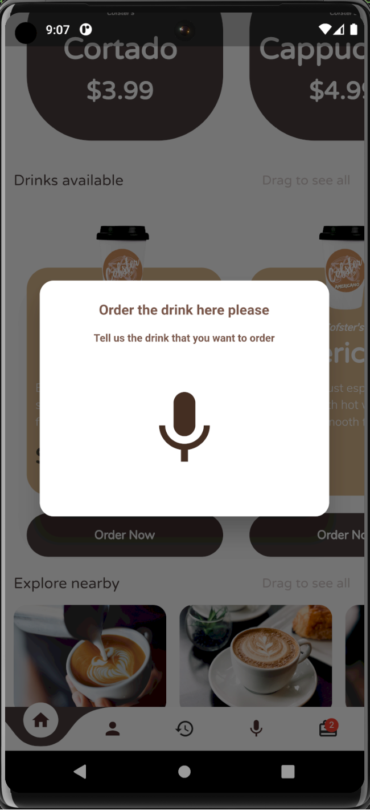
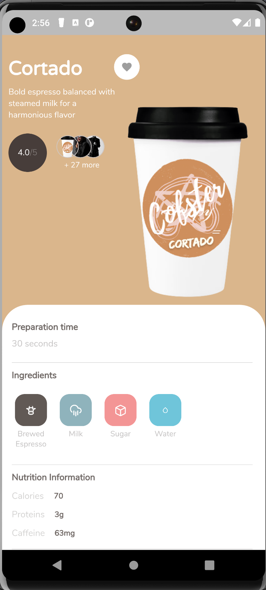
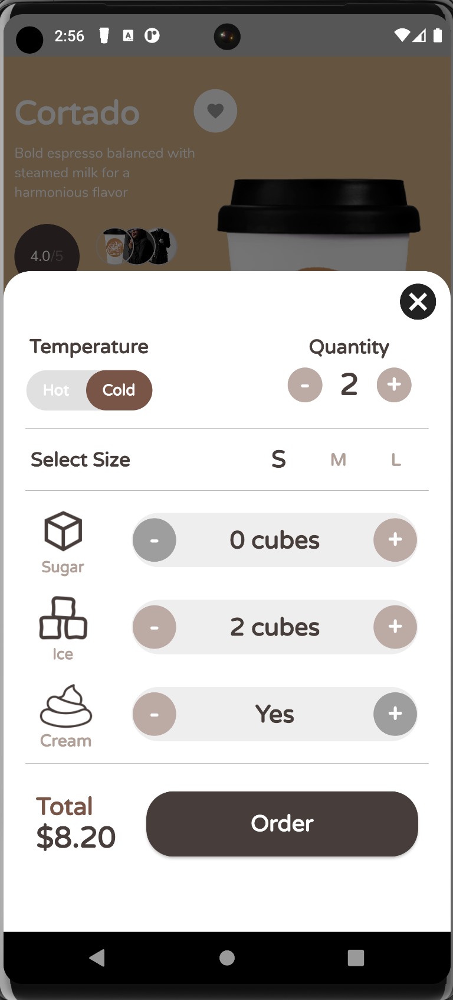

# Cofster (Smart Coffee Machine System)

Cofster is a sophisticated and innovative solution that combines cutting-edge technologies to revolutionize the coffee brewing experience. With advanced features such as personalized drink recommendations, voice recognition, and cloud integration, this system offers a seamless and convenient way to prepare your favorite coffee beverages.

## Features

- **Mobile App Control**: The system can be controlled through a user-friendly mobile app, allowing you to easily select and customize your coffee preferences.
- **Personalized Drink Recommendations**: By leveraging machine learning techniques, the system analyzes user responses to provide personalized drink recommendations based on individual tastes and preferences.
- **Voice Recognition**: Interacting with the system is effortless using voice commands. Simply speak your desired drink options, and the system will respond accordingly.
- **Location Services**: Integrated with Google Maps, the system can identify your location and display nearby coffee shops, making it easy to find a great cup of coffee wherever you are.
- **Hardware Control**: Using Raspberry Pi, relays, and pumps, the system accurately controls the coffee machine to ensure precise beverage preparation.
- **Cloud Services Integration**: The system leverages cloud services, including AWS microservices, for seamless data storage, retrieval, and communication between the backend and frontend components.
- **Clean Architecture Design**: The system follows a clean architecture, with the backend hosted on AWS and the frontend developed using Flutter. This design approach ensures modularity, scalability, and maintainability.

## Screenshots

Include screenshots here to showcase the user interface of the mobile application. You can add images to the `screenshots` folder and reference them like this:

  
  

  
  

  
   

  
  

## Getting Started

Follow these steps to set up the Smart Coffee Machine System:

1. Clone the repository: `git clone https://github.com/your-username/smart-coffee-machine.git`
2. Install the required dependencies: `npm install` or `pip install -r requirements.txt`
3. Configure the necessary cloud services and APIs by following the instructions provided in the documentation.
4. Connect the hardware components as specified in the hardware setup guide.

For detailed installation instructions, usage guidelines, and API documentation, please refer to the [documentation](docs).

## Contributing

Contributions are welcome! If you encounter any issues or have ideas for improvements, please open an issue or submit a pull request. We appreciate your feedback and contributions to make the Smart Coffee Machine System even better.

## License

This project is licensed under the MIT License. See the [LICENSE](LICENSE) file for more information.

## Acknowledgments

- [Flutter](https://flutter.dev/) - Beautiful native apps in record time
- [AWS](https://aws.amazon.com/) - Cloud Computing Services
- [Google Maps](https://cloud.google.com/maps-platform) - Mapping and location services

